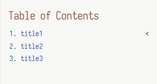

= Adoc
include::R:/Files/Workspace/Mine/Scripts/js/asciidoc/common/attributes.adoc[]

include::R:/Files/Workspace/Mine/Scripts/js/asciidoc/common/html-assets.adoc[]

== title1

描述

=== title11

[WARNING]
warning测试

==== title111

[TIP]
TIP测试

==== title112

代码块 `code` 以及 ``

=== title12

==== title121

[plantuml,,svg]
----
@startuml
title 权限校验时序图

actor "客户端" as Client
participant "旧项目 (代理层 Filter)" as OldProxy
participant "新项目 (权限校验 Filter)" as NewFilter
participant "新项目 (Controller)" as NewController
database "数据库" as DB

skinparam sequenceMessageAlign center

Client -> OldProxy: GET /api/new/price/getList
activate OldProxy

OldProxy -> OldProxy: 1. Shiro认证, 获取UserID
OldProxy -> NewFilter: 2. 转发请求\n(Header: X-Forwarded-User-ID = a_user_id)
activate NewFilter
deactivate OldProxy

NewFilter -> NewFilter: 3. 从Header中读取 UserID
NewFilter -> NewController: 4. 反射获取方法上的注解\n@RequiredPermission("/price")
note right of NewFilter: 确定接口所需权限

NewFilter -> DB: 5. 实时查询权限 (带缓存)\ncheckPermission(a_user_id, "/price")
activate DB
DB --> NewFilter: 返回: true (有权限)
deactivate DB

alt 权限校验通过 (hasPermission = true)
    NewFilter -> NewController: 6. 放行请求
    activate NewController

    NewController -> NewController: 7. 执行业务逻辑
    NewController --> NewFilter: 返回业务数据
    deactivate NewController

    NewFilter --> Client: 返回200 OK + 业务数据

else 权限校验失败 (hasPermission = false)
    NewFilter --> Client: 返回 403 Forbidden
end

deactivate NewFilter

@enduml
----

==== title122

.点击展开/折叠
[%collapsible]
====
这里是隐藏的内容。
====

== title2

代码

[,javascript]
----
window.addEventListener('DOMContentLoaded', () => {
    document.querySelectorAll('.sectlevel1>li>a').forEach((item) => {
        let listElement = item.parentElement.querySelector('ul');
        let div = document.createElement('div');
        let span = document.createElement('span');
        span.innerText = listElement ? '<' : '';
        div.appendChild(span);
        if (listElement) {
            listElement.classList.add('hide');
            span.style.transform = 'rotate(0deg)';
            div.addEventListener('click', (e) => {
                let ul = div.parentElement.querySelector('ul');
                if (ul) {
                    if (ul.matches('.hide')) {
                        ul.classList.remove('hide');
                        span.style.transform = 'rotate(-90deg)';
                    } else {
                        ul.classList.add('hide');
                        span.style.transform = 'rotate(0deg)';
                    }
                }
            });
        }
        item.insertAdjacentElement('afterend', div);
    });
});
----

== title3

图片

